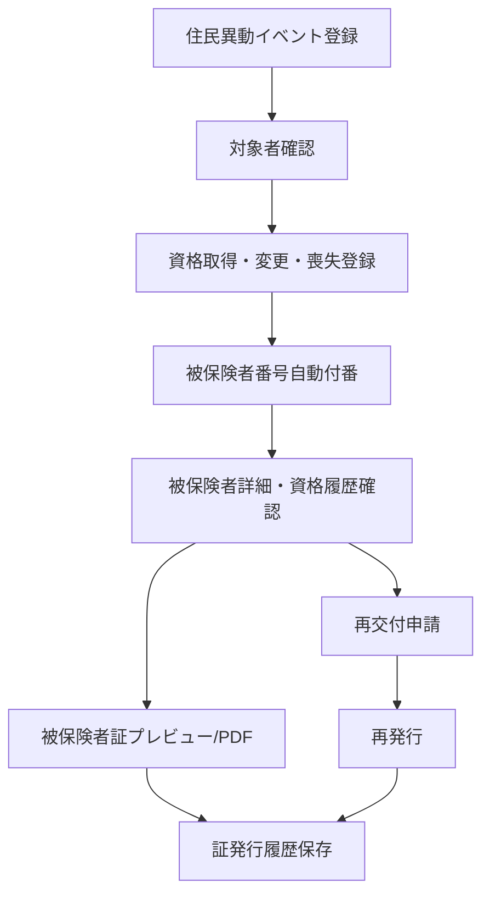

# 業務フロー定義

## 対象
- 02-01 住民情報異動等に伴う資格異動
- 02-02 被保険者証等再交付

## 業務フロー

## 業務ルール
- 被保険者番号はシステム自動付番
- 住民異動イベントは削除せず処理状態を持つ
- 発行履歴は必ず保存
- 再発行時は issue_type = reissue とする
- 資格喪失済みは被保険者証の新規発行対象外
- 外部連携はCSV/手入力/Seederで代替
- 0230010の帳票完全再現ではなく、主要印字項目と見た目の簡易再現を優先

## 画面ラベル
各画面に以下を表示する。
- 対応業務
- 対応機能ID
- 対応帳票ID
- PoC Must / Stretch
