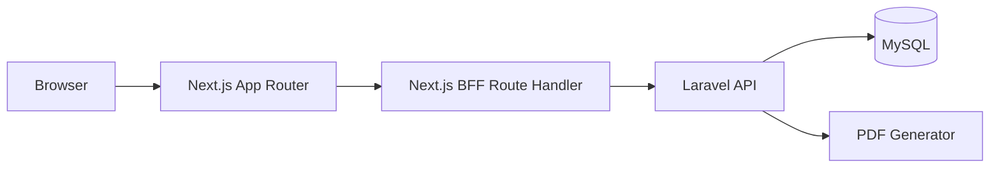

# アーキテクチャ・BFF・セキュリティ方針

## 推奨構成

## BFFの役割
- Laravel API URLをブラウザから隠す
- Cookie/Tokenを扱う
- 画面向けに軽くレスポンスを整える
- 複数APIの結合が必要な時のみまとめる

## BFFに持たせないもの
- 業務ルール
- DBアクセス
- 帳票ロジック
- バリデーションの正本
- 対象外業務

## Laravelの役割
- 業務ルール
- DB永続化
- PDF生成
- 履歴登録
- バリデーション正本

## 認証
- 推奨: Laravel Sanctum + BFF cookie/session
- 代替: demo_user固定注入
- 変更系処理には created_by / updated_by を残す

## セキュリティ Must
- 実在個人情報を使わない
- .envでシークレット管理
- ORM/Query Builder使用
- XSS対策として画面エスケープ
- 変更系APIはCSRFまたはトークン保護
- ログに個人情報を出しすぎない

## 禁止
- BFFを厚くしない
- GraphQL/gRPCにしない
- RBACを作り込みすぎない
- マイクロサービス化しない
