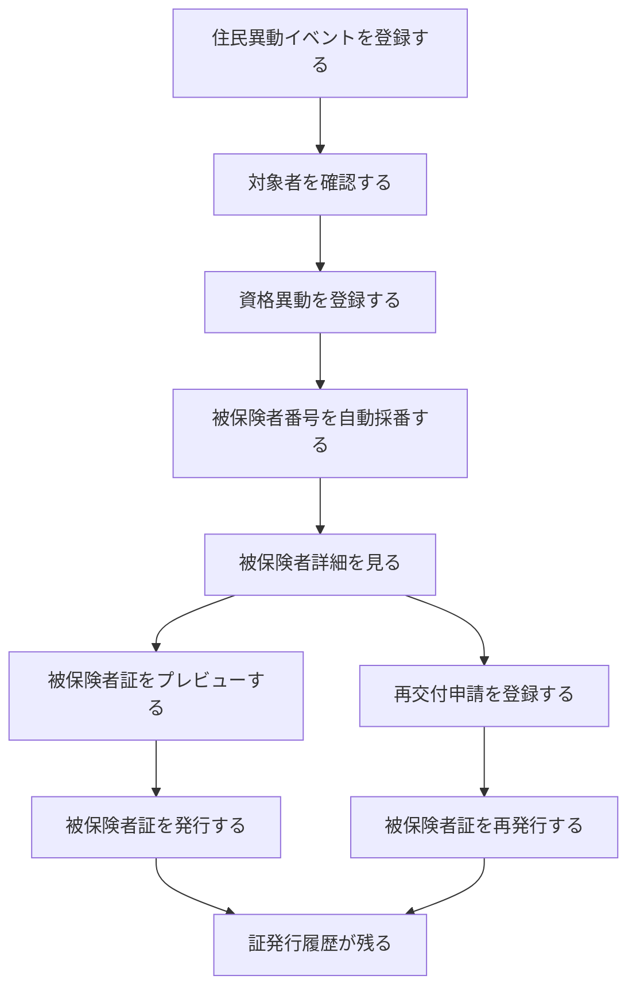
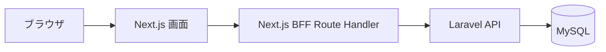

# はじめに読む資料：今回の介護保険デモで何を作るのか

## この資料セットの目的

この `docs/beginner/` 配下の資料は、介護保険システムや自治体システムをほとんど知らない人が、標準仕様書を直接読まなくても、今回のデモ改修に必要な範囲を理解できるように作った補助資料です。

対象は、介護保険システム全体ではありません。今回のデモで扱うのは、**被保険者資格**の一部です。

具体的には、次の2つだけを中心にします。

1. **住民情報異動等に伴う資格異動**
2. **被保険者証等再交付**

この2つを、初心者向けに言い換えるとこうです。

- 市民が65歳になった、転入した、転出した、亡くなった、住所が変わった。
- その変化を介護保険システムに反映する。
- 必要に応じて、介護保険の被保険者として登録する。
- 被保険者証を出力する。
- 被保険者証をなくした場合などに再交付する。

今回のデモは、この流れを **Next.js + Laravel + MySQL** で小さく作るものです。

---

## 標準仕様書のどこを見ればよいのか

標準仕様書は複数ファイルに分かれています。

- 標準仕様書
- 別紙1 業務フロー
- 別紙2 機能・帳票要件
- 別紙3 帳票詳細要件
- 別紙4 帳票レイアウト
- データ要件・連携要件

ただし、今回のデモでは全部を読む必要はありません。必要なのは、次の範囲だけです。

| 資料 | 今回見る範囲 | 何に使うか |
|---|---|---|
| 標準仕様書 | 全体の考え方だけ | 介護保険システムの位置づけ理解 |
| 別紙1 業務フロー | 02-01、02-02 | 業務の流れを理解する |
| 別紙2 機能・帳票要件 | 0230265〜0230300付近 | 実装する機能の根拠 |
| 別紙3 帳票詳細要件 | 0230010、0230014 | 帳票に何を印字するか |
| 別紙4 帳票レイアウト | 0230010、0230014 | 帳票の見た目 |
| データ要件・連携要件 | 住民情報、被保険者情報、証交付情報 | DB項目やCSV項目の参考 |

---

## 今回作るデモの完成イメージ

今回のデモで見せたいのは、以下の一連の流れです。



簡単に言うと、

> 住民の変化を取り込んで、介護保険の資格を作り、被保険者証を出し、履歴を残す

というデモです。

---

## 技術構成

今回の技術構成は以下です。

| 層 | 技術 | 役割 |
|---|---|---|
| フロントエンド | Next.js + TypeScript + Tailwind CSS + shadcn/ui | 画面表示 |
| BFF | Next.js Route Handler | フロントとLaravel APIの中継 |
| バックエンド | Laravel | 業務ロジック、DB操作、帳票生成 |
| DB | MySQL | データ保存 |
| 帳票 | Laravel側でHTML/PDF生成 | 被保険者証などの出力 |

### BFFとは何か

BFFは **Backend For Frontend** の略です。

今回の構成では、ブラウザが直接Laravel APIを呼ぶのではなく、いったんNext.jsのAPIに投げて、Next.jsがLaravel APIを呼ぶ形を想定します。



BFFを使うメリットは、フロント側にLaravel APIの詳細や認証情報を直接持たせずに済むことです。

ただし、今回はPoCなので、BFFに複雑な業務ロジックを入れません。業務ルールはLaravel側に置きます。

---

## この資料セットの読み方

おすすめ順は以下です。

1. `beginner_00_readme_first.md`
2. `beginner_01_care_insurance_basic.md`
3. `beginner_02_demo_scope_plain_japanese.md`
4. `beginner_03_business_flow_plain_japanese.md`
5. `beginner_04_terms_glossary.md`
6. `beginner_05_screen_api_db_mapping.md`
7. `beginner_06_implementation_rules_for_cursor.md`

Cursorに読ませる場合は、既存の `docs/` の実装用資料と合わせて、この `beginner/` フォルダも読ませてください。

最初のプロンプト例：

```text
docs配下のmdファイルと docs/beginner 配下のmdファイルをすべて読んでください。
まだ実装はしないでください。

まず、今回の介護保険デモで作る範囲を、初心者にも分かる言葉で要約してください。
その後、実装対象の画面・API・DB・帳票を一覧化してください。
Outに書かれているものは実装しないでください。
```

---

## 重要な注意

今回の資料は、本番システムを完全に作るための資料ではありません。

あくまで、7/1デモに向けて、

- 標準仕様書の一部を理解する
- 画面、API、DB、帳票を小さく作る
- Cursorに迷わせず実装させる
- 説明できるデモを作る

ための資料です。

自治体本番システムとして必要な、権限管理、監査ログ、非機能要件、外部システム連携、データ移行、法制度上の細かい例外までは扱いません。
